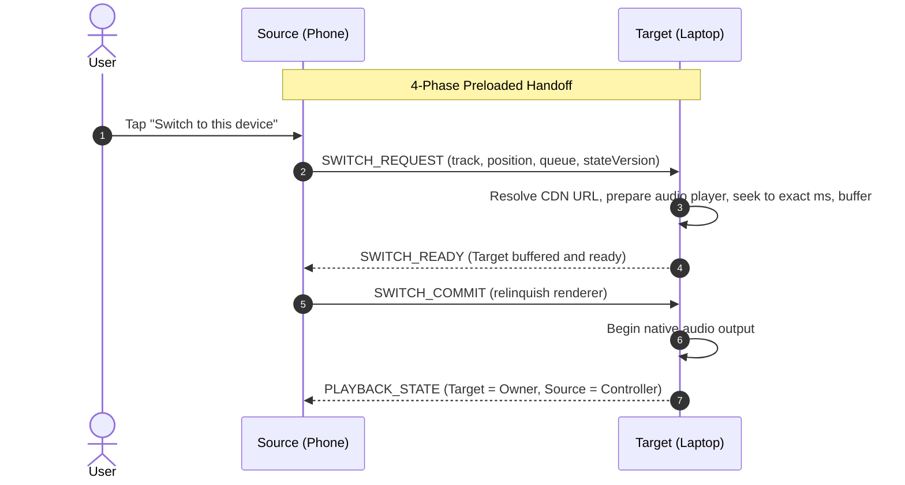

# Shiddat Connect V2 — Master Architectural Reference & Acceptance Specification

This document serves as the **canonical reference specification** for Shiddat Connect V2. It synthesizes Spotify Connect observable behavior and developer architecture into a robust, direct-authenticated LAN + Cloud protocol designed specifically for Shiddat.

---

## 🏛️ 1. The Fundamental Spotify-Grade Model

Shiddat strictly separates the 5 stages of cross-device interaction:
```text
DISCOVERY ──► DEVICE ──► ACTIVE PLAYBACK DEVICE ──► REMOTE CONTROL ──► PLAYBACK STATE
```

* **Target Hardware Plays Audio Directly**: The target device resolves the audio stream from the CDN and decodes it locally to native hardware speakers.
* **Controller Transmits Remote Commands**: The phone/laptop does not stream raw audio over Wi-Fi; it functions purely as an ultra-low-latency remote control.
* **Single Authoritative Audio Owner**: Exactly one device outputs audio at any time.

```text
📱 Mobile (Controller)
   │
   │  commands (PLAY, PAUSE, NEXT, SEEK, VOLUME)
   │  state synchronization
   ▼
💻 Desktop (Owner)
   │
   ▼
CDN Stream ──► Native Audio Player ──► Speakers
```

---

## 🛡️ 2. Discovery vs. Authorization Security Boundary (Hostel Scenario)

In environments with shared Wi-Fi networks (hostels, universities, offices, cafes):
```text
Shared Wi-Fi Network
   ├── 📱 Your Phone (Account A)
   ├── 💻 Your Laptop (Account A)
   ├── 📱 Friend's Phone (Account B)
   ├── 💻 Roommate's Laptop (Account B)
   └── 📺 Shared TV
```

### The Invariant: `DISCOVERED ≠ AUTHORIZED`
1. **Discovery**: Shiddat discovers all capable peers on the local subnet via mDNS / NSD (`_shiddat-connect._tcp`).
2. **Same Account (`SAME_ACCOUNT`)**:
   * Devices logged into the identical Shiddat user account are automatically trusted.
   * Full remote control and instant playback switching enabled.
3. **Different Account (`DIFFERENT_ACCOUNT`)**:
   * Device appears in the Connect menu under **"Other Shiddat Devices"** with a `Different account` badge.
   * Control is **never** granted silently.
   * User must tap `[ Request Control ]` $\to$ Target device receives an interactive authorization prompt to grant/deny control.

---

## 🎛️ 3. Control vs. Switch Distinction

* **Control (`Remote Control`)**: Target continues playing audio. Source UI turns into a synchronized remote controller without taking audio ownership.
* **Switch (`Playback Handoff`)**: Audio ownership is transferred to the new device with target preloading ("switch without missing a beat").



---

## ⚡ 4. Authoritative State & Atomic Synchronization

All playback parameters move together in **one atomic payload** with an incrementing `stateVersion`:

```json
{
  "ownerDeviceId": "dev_desktop_1",
  "songId": "track_456",
  "song": {
    "id": "track_456",
    "title": "Song Title",
    "artist": "Artist Name",
    "album": "Album Name",
    "coverUrl": "https://covers.cdn/track_456.jpg",
    "duration": 273
  },
  "queue": [ ... ],
  "queueIndex": 3,
  "positionMs": 165000,
  "durationMs": 273000,
  "isPlaying": true,
  "playbackRate": 1.0,
  "volume": 0.85,
  "isMuted": false,
  "shuffleMode": "OFF",
  "repeatMode": "OFF",
  "stateVersion": 204,
  "timestamp": 1724310000000
}
```

### Eliminating Cover / Metadata Mismatch:
When the owner advances tracks (automatically or via remote `NEXT`), the owner resolves the next song and broadcasts the atomic payload. Both local and remote UIs update title, artwork, duration, position (`00:00`), and queue index in **one unified render cycle**.

---

## ⏱️ 5. Shared Seek Bar & Anchor Clock Interpolation

### Exact Milliseconds:
* Remote commands send exact `positionMs` (e.g. `165000ms`), never imprecise percentages.

### Zero Drag Flooding:
* While dragging: slider updates local UI preview smoothly at 60 FPS (**zero network packets sent while actively dragging**).
* On drag release (`onPointerUp`): exactly **ONE** `CMD_SEEK` packet is dispatched to the owner.

### Seeking Invariants:
* **Paused Seek**: If paused at `02:00` and sought to `03:15` $\to$ remains `PAUSED` at `03:15` (zero auto-resume).
* **Playing Seek**: If playing at `02:00` and sought to `03:15` $\to$ remains `PLAYING` at `03:15` with audio continuing.

### Remote Anchor Clock:
* The owner broadcasts anchor state periodically.
* The controller interpolates smooth progress locally without high-frequency polling:
  $$\text{Current Position} = \text{positionMs} + (\text{Date.now()} - \text{timestamp}) \times \text{playbackRate}$$

---

## 🔌 6. Immediate Non-Interruptive Disconnect & Failure Modes

1. **Controller Disconnects**:
   * Session terminates immediately on both devices.
   * **The Owner's native playback is NEVER paused or stopped.**
2. **Controller Reconnects**:
   * Controller connects $\to$ requests fresh state snapshot $\to$ displays exact live song and position (never stale cached state).
3. **Owner Disappears / Crashes**:
   * Controller does **not** automatically assume ownership (avoids split-brain).
   * Controller shows `Playback device unavailable [ Play on this device ]` for explicit user action.
4. **Transient Network Drop**:
   * State transitions `CONNECTED` $\to$ `RECONNECTING` $\to$ `CONNECTED` without killing session prematurely.

---

## 🏷️ 7. Device State Taxonomy & Capabilities

### Device List States:
* `AVAILABLE`: Discovered on LAN or Cloud, ready to connect.
* `CONNECTING`: Cryptographic / session handshake in progress.
* `CONNECTED`: Active session established.
* `CONTROLLING`: Active remote controller for remote owner.
* `OWNER`: Currently playing native audio.
* `RECONNECTING`: Temporary link recovery.
* `DISCONNECTED`: Session cleanly torn down.
* `UNAUTHORIZED`: Visible on shared Wi-Fi, requires pairing grant.
* `OFFLINE`: Unreachable or powered off.

### Capability Restrictions:
* `canPlay`, `canPause`, `canSeek`, `canNext`, `canPrevious`, `canVolume` flags prevent illegal remote interactions.

---

## 🏆 8. Canonical Acceptance Matrix & Gold-Standard Tests

```text
Test 1: Mobile controls Desktop
Mobile -> NEXT        ==> Both show new song & artwork atomically
Mobile -> PREVIOUS    ==> Both show previous song & artwork atomically
Mobile -> SEEK        ==> Both snap to same millisecond position
Mobile -> PLAY/PAUSE  ==> Both update playing state
Mobile -> Disconnect  ==> Immediate disconnect, Desktop continues playing normally

Test 2: Desktop controls Mobile
Desktop -> NEXT       ==> Both show new song & artwork atomically
Desktop -> PREVIOUS   ==> Both show previous song & artwork atomically
Desktop -> SEEK       ==> Both snap to same millisecond position
Desktop -> PLAY/PAUSE ==> Both update playing state
Desktop -> Disconnect ==> Immediate disconnect, Mobile continues playing normally
```
