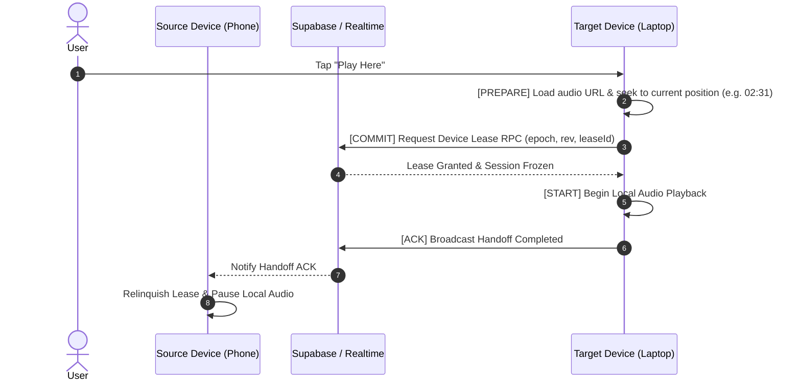

# Shiddat Cross-Device Subsystem — Deep Architecture & Acceptance Specification

This document defines the strict, authoritative specification for the Shiddat Cross-Device Subsystem: **Discovery**, **Remote Control**, and **Playback Handoff**.

---

## 🏛️ Master Architectural Principles

```
                        ACCOUNT
                           │
                    PLAYBACK SESSION
                           │
         ┌─────────────────┼─────────────────┐
         ↓                 ↓                 ↓
      Phone             Laptop              TV
   Controller          Renderer          Controller
```

### 10 Core Hard Rules:
1. **Rule 1:** Opening another device never starts music (Zero Autoplay).
2. **Rule 2:** Viewing devices never changes playback.
3. **Rule 3:** Selecting "Play Here" is an explicit user command.
4. **Rule 4:** Only one renderer owns active playback for an account session.
5. **Rule 5:** Controller devices never create an independent playback queue.
6. **Rule 6:** Every device reads the same authoritative `PlaybackSession`.
7. **Rule 7:** A stale device cannot overwrite a newer session revision.
8. **Rule 8:** A failed handoff must preserve the old renderer without audio interruption.
9. **Rule 9:** A new device joining does not automatically take ownership.
10. **Rule 10:** Account synchronization and playback transfer are independent operations.

---

## 🔄 The 4-Phase Handoff Transaction Flow



---

## 📋 The 30 Cross-Device Acceptance Scenarios (CD-001 to CD-030)

| ID | Scenario | Expected Behaviour & State Outcome |
| :--- | :--- | :--- |
| **CD-001** | Phone plays, Laptop opens | Laptop displays "Playing on Phone" in paused state. **Zero audio plays on laptop.** |
| **CD-002** | Phone plays, Laptop taps "Play Here" | Laptop continues exact song & position (within 150ms drift). Phone pauses. |
| **CD-003** | Laptop playing, Phone taps Pause | Remote `PAUSE` command dispatched → Laptop pauses → ACK broadcast → Phone UI updates. |
| **CD-004** | Laptop playing, Phone taps Next | Central session advances `queueIndex + 1` → Laptop loads next song. No jump backward. |
| **CD-005** | Shuffle active during handoff | `shuffleSeed` and deterministic sequence preserved identically on target device. |
| **CD-006** | Repeat One active during handoff | `repeatMode: 'one'` preserved identically on target device. |
| **CD-007** | Playlist active during handoff | Entire source playlist queue is transferred without truncation or modification. |
| **CD-008** | Target device buffering fails | 8s timeout triggers rollback → Phone retains lease and continues audio. |
| **CD-009** | Active device crashes / loses power | Heartbeat expires → Phone shows "Laptop unavailable" + explicit `[Resume Here]` button. |
| **CD-010** | Device reconnects with old revision | Device receives newer revision from server; local stale state is rejected. |
| **CD-011** | Simultaneous "Play Here" on 2 devices | Server serializes requests; exactly one lease is committed; zero dual-playback. |
| **CD-012** | Rapid double Next tap | Command debounced through state machine; queue steps forward cleanly. |
| **CD-013** | Delayed remote command | Rejected due to stale `epoch` / `revision` mismatch. |
| **CD-014** | Network lost during handoff | Handoff coordinator rolls back cleanly; source remains active. |
| **CD-015** | Refresh active device | Session checkpoint restored as `PAUSED`. Never autoplays on reload. |
| **CD-016** | Same account on Phone & Laptop | Likes, playlists, and listening history converge seamlessly on both devices. |
| **CD-017** | Stale local mobile cache | Reconciled against authoritative Supabase `liked_songs` cloud dataset. |
| **CD-018** | User logs into Account B | Account A device registrations, library, and session state are instantly cleared. |
| **CD-019** | Three devices active | Exactly 1 renderer outputs audio; other 2 act as synchronized controllers. |
| **CD-020** | Laptop goes offline | Phone device picker immediately marks Laptop as "Offline". |
| **CD-021** | Laptop comes online | Phone device picker immediately marks Laptop as "Available". |
| **CD-022** | Song naturally finishes | Active renderer triggers authoritative queue advance and broadcasts new revision. |
| **CD-023** | Album ends + Autoplay OFF | Playback cleanly halts (`STOP`) across all observing devices. |
| **CD-024** | Album ends + Autoplay ON | Recommendation engine appends discovery track after source queue completes. |
| **CD-025** | Play Here on paused session | Target device prepares paused session; user can explicitly start audio. |
| **CD-026** | Bluetooth disconnect | Audio pauses safely on active renderer. |
| **CD-027** | Screen locked on mobile | Media3 ExoPlayer foreground service keeps audio playing smoothly. |
| **CD-028** | Controller app killed | Active renderer continues uninterrupted. |
| **CD-029** | Renderer app killed | Controller detects lease timeout and prompts `[Resume Here]`. |
| **CD-030** | Audio CDN URL expires | Resolver fetches fresh streaming URL without altering active song or queue position. |
